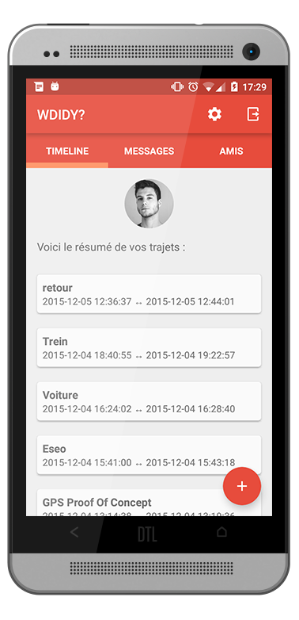

# WDIDY 1.8.0

WDIDY? - What Did I Do Yesterday ? → [Fichier APK](https://github.com/rascafr/WDIDY/raw/master/app/app-release.apk)

 

WDIDY? est un réseau social basé sur la position GPS de vos amis et les trajets que vous effectuez en soirée.

Discutez à l'aide de la messagerie intégrée, organisez vos soirées, lancez l'enregistrement GPS et soyez sûr que WDIDY? vous aidera à vous rappeler de vos soirées difficiles ...

* Juin 2016 : Service de localisation par API + offline et envoi en arrière plan fonctionnels